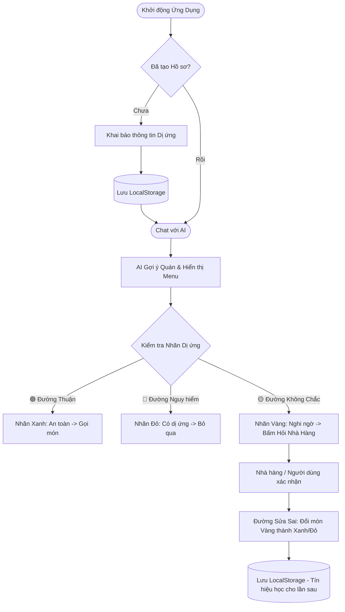

# Báo Cáo Chuyên Sâu: AI Món Ăn (Product & Technical Report)

Tài liệu này được soạn thảo dựa trên yêu cầu của Hackathon Day 6 (chuẩn 8 phần), kết hợp phân tích Sản phẩm (Product Spec) và chi tiết Kỹ thuật (Technical Implementation).

---

## 1. Bằng chứng (Vấn đề và Nguồn gốc)

**Nỗi đau của người dùng:** Người bị dị ứng thực phẩm, hoặc có chế độ ăn kiêng nghiêm ngặt gặp rất nhiều rủi ro và khó khăn khi tìm nhà hàng để ăn ngoài. Các ứng dụng delivery chỉ hiển thị menu chứ không lọc món ăn theo hồ sơ sức khoẻ cá nhân.

**Bằng chứng quan sát:** 
- *Trải nghiệm trực tiếp:* Nhóm tự đóng vai người bị dị ứng đậu phộng và tôm, đi ăn ở quán lạ. Rất khó để biết trong bát phở trộn hoặc gỏi cuốn có rắc lạc/tôm khô hay không, trừ khi hỏi trực tiếp đầu bếp.
- *Nguồn bên ngoài:* Rất nhiều đánh giá của khách du lịch nước ngoài trên các diễn đàn (như TripAdvisor, Reddit) chia sẻ rằng rào cản lớn nhất khi thưởng thức ẩm thực Việt Nam là sự mập mờ trong thành phần món ăn (nước mắm tôm cá, bột ngọt, các loại hạt bí mật trong nước chấm).

---

## 2. Lát cắt để build (Phạm vi Prototype & Kiến trúc)

**Một câu tóm tắt:** "Một người dùng bị dị ứng tìm quán ăn tối; trợ lý AI tự động quét menu của các quán xung quanh, dán nhãn Xanh (an toàn) / Đỏ (nguy hiểm) / Vàng (cần hỏi thêm) cho từng món, và chốt quán có số món Xanh cao nhất."

### 2.1 Kiến trúc hệ thống & Công nghệ
Hệ thống được thiết kế theo kiến trúc **Client-Side Heavy SPA (React + TypeScript + Vite)** kết hợp API LLM từ xa:
- **Frontend:** React 18, Vite, Vanilla CSS.
- **Storage:** `localStorage` API (lưu User Profile, lịch sử xác nhận món Vàng).
- **AI Engine:** Kết hợp Rule-based Regex (chạy tại trình duyệt cho tốc độ < 1ms) và LLM từ xa (qua API OpenRouter / DeepSeek) để tạo hội thoại tự nhiên.

### 2.2 Pipeline xử lý (NLU & Ranking)
1. **Tiền xử lý & Intent Classification:** Chuyển câu hỏi người dùng thành các ý định (intent) như `suggest`, `ingredients`, `chay`, `rating` bằng chuỗi luật if-else.
2. **Allergen Keyword Matrix:** Ma trận 9 loại dị ứng ánh xạ tới hàng chục từ khoá tiếng Việt. Thuật toán `detectAllergensInDish()` lấy chuỗi `tên món + nguyên liệu` đem đối chiếu với ma trận để bắt các chất gây dị ứng.
3. **Fuzzy Dish Matching:** Thuật toán tìm kiếm món ăn mờ để trả về thông tin chi tiết dù người dùng gõ sai hoặc thiếu chữ.

---

## 3. AI Product Canvas

| Thành phần | Câu trả lời |
| :--- | :--- |
| **Value (Giá trị)** | **Cho ai:** Người dị ứng/ăn kiêng. **Đau ở đâu:** Mệt mỏi dò hỏi, lo sợ ăn nhầm món gây nguy hiểm. **AI giải được gì:** Đọc, đối chiếu ma trận dị ứng và phân loại hàng trăm món ăn trên menu cực nhanh. |
| **Trust (Niềm tin)** | Nếu AI đánh sai nhãn, rủi ro là cực lớn. Hệ thống dùng **nhãn Vàng** (chưa chắc chắn) để buộc con người can thiệp. Người dùng có quyền sửa và báo lỗi trực tiếp trên UI. |
| **Feasibility (Khả thi)** | Chi phí gọi API thấp do LLM chỉ giao tiếp, còn logic phân loại lõi (Filtering & Tagging) chạy bằng Rule-based ở máy khách. Dữ liệu menu lấy dễ dàng từ các nền tảng delivery. |
| **Tín hiệu học** | Khi món Vàng được xác nhận thành Xanh/Đỏ, dữ liệu lưu vào LocalStorage. Thuật toán tự động "ghi nhớ" quy tắc này, người dùng sau có cùng dị ứng không cần phải hỏi lại. |

---

## 4. Tăng năng lực (Augment) hay Tự động hóa (Automate)

**Lựa chọn:** Tăng năng lực (Augment).

**Lý do:** Rủi ro sức khỏe (sốc phản vệ) là không thể hoàn tác, không thể giao toàn quyền cho AI. AI chỉ đóng vai trò *bộ lọc thô* giúp thu hẹp phạm vi.

### Cơ chế Kỹ thuật bảo vệ mức Augment (Thuật toán Gắn nhãn `tagDish`)
Mỗi món ăn đi qua một cây quyết định (Decision Tree) 5 bước:
1. Có khai báo dị ứng không? (Không -> Xanh)
2. Món có mơ hồ không? (Ví dụ: tên chứa "cá kho" nhưng không rõ loại cá, và nguyên liệu < 4 -> Ép sang **Vàng** để ép người dùng hỏi nhà hàng).
3. Nhà hàng đã xác nhận chưa? (Nếu rồi -> Dùng kết quả đã nhớ).
4. Ma trận từ khoá có phát hiện chất dị ứng không? (Có -> Đỏ).
5. Cuối cùng -> Xanh.

Sau đó, hệ thống tính **Safety Score = Số món Xanh / Tổng món** để gợi ý và xếp hạng các nhà hàng an toàn nhất.

---

## 5. Bốn đường đi của trải nghiệm

Dưới đây là sơ đồ User Flow thực tế kết hợp 4 đường đi:

---

## 6. Những kiểu lỗi đáng lo nhất

1. **False Positive (Báo an toàn nhưng có thành phần gây dị ứng):** 
   - *Nguyên nhân:* Tên món hoặc mô tả bị thiếu nguyên liệu (VD: Gỏi đu đủ không ghi rõ có rắc tôm khô).
   - *Hậu quả:* Sốc phản vệ, cực kỳ nguy hiểm.
   - *Cách xử lý:* Logic nhận diện "Món mơ hồ" (Ambiguous Dish) sẽ chủ động rào trước và dán nhãn Vàng. Hiển thị Disclaimer cảnh báo rõ ràng.

2. **Ảo giác AI (Hallucination) & Out-of-Scope:**
   - *Nguyên nhân:* AI tự bịa nguyên liệu hoặc trả lời sai chủ đề.
   - *Cách xử lý (Đã code):* Áp dụng **Out-of-Scope Guard** (chuỗi Regex chặn các từ khoá ngoài luồng như code, thời tiết, chính trị). Nếu vi phạm, AI ngắt và từ chối trả lời ngay ở client. Prompt LLM cũng được ép cứng nguyên tắc: *"KHÔNG bịa quán, bịa món. Nếu không có trong catalog -> Báo không tìm thấy"*.

---

## 7. Kế hoạch kiểm thử và Bằng chứng demo

- **Test case 1 (Đường thuận):** 
  - *Hành động:* Khai báo dị ứng "Hải sản". Tra quán bò. 
  - *Kỳ vọng:* Các món bò dán nhãn Xanh, AI gợi ý các quán Bò với Safety Score cao.
- **Test case 2 (Đường không chắc chắn & Tín hiệu học):** 
  - *Hành động:* Khai báo dị ứng "Đậu phộng". Xem menu món "Nộm bò khô". 
  - *Kỳ vọng:* Hệ thống bắt được sự mơ hồ -> Dán nhãn Vàng.
  - *Hành động tiếp:* Người dùng ấn nút "Hỏi nhà hàng" và xác nhận. Nhãn chuyển thành Xanh/Đỏ và lưu vĩnh viễn trong phiên (F5 vẫn giữ nguyên).
- **Bằng chứng:** Sẽ chuẩn bị Slide thuyết trình HTML, Code base hoàn chỉnh chứa Rule-based Regex và luồng hoạt động trực tiếp trên Console trình duyệt.

---

## 8. Phân công

- **Đỗ Quốc An (2A202600952):** Phụ trách quản lý dự án, viết tài liệu SPEC. Khi demo: Trình bày về workflow dự án và scoring matrix.
- **Nguyễn Khánh Linh (2A202600856):** Thiết kế UX/UI, xây dựng luồng Onboarding và giao diện Chatbot. Kiểm thử và cải thiện prompt.
- **Trần Diệu Linh (2A202600875):** Kỹ sư Prompt (Prompt Engineering), thử nghiệm và xử lý các trường hợp AI bị ảo giác. Khi demo: Thao tác Demo tính năng dán "Nhãn Vàng" và xử lý luồng bất định, phụ trách thao tác Demo trực tiếp trên màn hình.
- **Thân Minh Hiếu (2A202600854):** Kỹ sư dữ liệu, xây dựng Ma trận từ khóa dị ứng (Allergen Matrix) và logic thuật toán `tagDish()`. Xử lý API OpenRouter và quản lý trạng thái qua LocalStorage.
- **Trần Minh Quang (2A202600924):** Backend & Tích hợp hệ thống. Khi demo: Trả lời Q&A về luồng dữ liệu, bảo mật và khả năng mở rộng kiến trúc.
