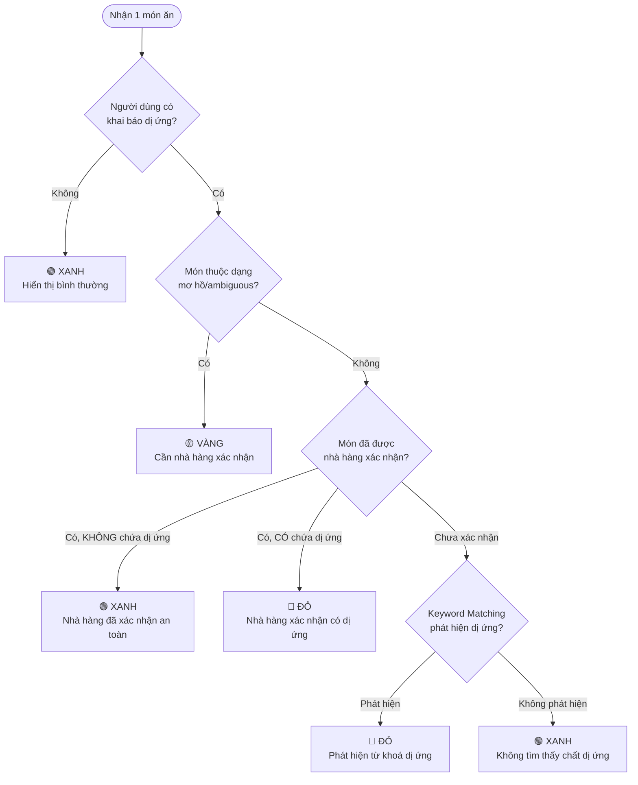

# Báo Cáo Kỹ Thuật (Technical Report) - AI Món Ăn

Tài liệu này trình bày chi tiết về luồng hoạt động, kiến trúc hệ thống, các công nghệ sử dụng và pipeline xử lý hoàn chỉnh của dự án AI Món Ăn.

---

## 1. Kiến trúc hệ thống (System Architecture)

Hệ thống được thiết kế theo kiến trúc **Client-Side Heavy (Single Page Application)**, trong đó phần lớn logic xử lý, quản lý trạng thái, và phân tích dữ liệu được thực hiện trực tiếp trên trình duyệt của người dùng. Hệ thống có khả năng giao tiếp với một API bên ngoài để xử lý ngôn ngữ tự nhiên (LLM Chat).

**Các khối kiến trúc chính:**
1. **User Interface (UI) Layer:** Chịu trách nhiệm hiển thị giao diện giả lập thiết bị di động (Device Preview Shell), Bản đồ hiển thị nhà hàng và giao diện Chatbot.
2. **State Management & Storage:** Quản lý trạng thái thông qua React State và tự động đồng bộ xuống `localStorage` để duy trì phiên đăng nhập và hồ sơ người dùng (bao gồm danh sách dị ứng).
3. **Data Layer (Mocked):** Chứa dữ liệu cứng (mock data) của 30 nhà hàng, toạ độ giả lập và danh sách các món ăn/thành phần.
4. **AI Processing Layer:** Xử lý đầu vào của người dùng trong chat. Bao gồm 2 phần:
   - *Local NLP Engine:* Sử dụng Regex và thuật toán chấm điểm (Scoring) để phân loại câu hỏi, trích xuất thực thể (tên món, khu vực) và xếp hạng nhà hàng (Ranking).
   - *Remote LLM Engine:* Gọi API bên ngoài (`/api/chat`) để sinh phản hồi tự nhiên khi cần thiết.

---

## 2. Tech Stack (Các công nghệ sử dụng)

- **Ngôn ngữ lập trình:** TypeScript, HTML5, CSS3.
- **Frontend Framework:** React 18 (sử dụng Functional Components & Hooks).
- **Build Tool:** Vite (giúp build nhanh và hỗ trợ HMR - Hot Module Replacement).
- **Styling:** Vanilla CSS (tùy biến giao diện linh hoạt, không phụ thuộc thư viện thứ 3).
- **Lưu trữ dữ liệu:** `localStorage` API (lưu User Profile, Auth, và lịch sử đánh giá món ăn "nhãn Vàng").
- **API Communication:** Fetch API (gọi LLM bên ngoài thông qua biến môi trường `VITE_API_URL`).

---

## 3. Pipeline xử lý hoàn chỉnh (Processing Pipeline)

Hệ thống xử lý luồng dữ liệu (Data Pipeline) từ lúc người dùng tương tác cho đến khi AI trả kết quả được chia làm 3 giai đoạn chính:

### Giai đoạn 1: Onboarding & Xây dựng hồ sơ (Profile Building)
1. Người dùng truy cập ứng dụng và thực hiện "Đăng nhập".
2. **Khai báo y tế:** Ứng dụng yêu cầu người dùng chọn các thành phần dị ứng (ví dụ: Hải sản, Đậu phộng, Sữa...).
3. Dữ liệu này được đóng gói thành đối tượng `UserProfile` và ghi xuống `localStorage`.

### Giai đoạn 2: Tương tác Chat & Phân tích yêu cầu (NLU Pipeline)
Khi người dùng gõ tin nhắn vào khung chat (ví dụ: *"Tìm quán bún chả không có lạc"*):
1. **Tiền xử lý văn bản (Normalization):** Chuyển chuỗi về chữ thường, loại bỏ dấu nếu cần.
2. **Kiểm tra ngoại lệ (Out of Scope):** Regex chặn các câu hỏi không liên quan (chính trị, code, thời tiết).
3. **Phân loại câu hỏi (Intent Classification):** Engine tại file `aiChat.ts` phân loại câu hỏi thành các nhóm: `suggest` (gợi ý), `ingredients` (hỏi nguyên liệu), `dish` (hỏi món cụ thể), `allergy` (hỏi về dị ứng), `chay` (hỏi đồ chay).
4. **Trích xuất thông tin (Entity Extraction):** Bắt các từ khoá về khu vực ("Cầu Giấy", "Hoàn Kiếm") hoặc loại ẩm thực ("bún bò", "bánh mì").

### Giai đoạn 3: Phân tích Dữ liệu và Xếp hạng (Scoring & Ranking)
1. **Lọc cơ sở (Filtering):** Lấy danh sách 30 nhà hàng từ mock data. Lọc theo khu vực hoặc loại món (nếu có).
2. **Chấm điểm An toàn (Allergy Scoring):** Chạy thuật toán `rankRestaurants`. 
   - Quét từng món trong menu của quán.
   - Đối chiếu thành phần món ăn với `UserProfile` (dị ứng).
   - Dán nhãn **Xanh** (An toàn), **Đỏ** (Nguy hiểm), hoặc **Vàng** (Không chắc chắn).
   - Tính toán tỷ lệ phần trăm (%) số món Xanh của quán.
3. **Sinh phản hồi (Response Generation):**
   - Sắp xếp top 5 quán an toàn nhất.
   - Định dạng văn bản trả về (Markdown & HTML) cho hiển thị thẻ nhà hàng (Restaurant Card).
   - (Tùy chọn) Gửi payload gồm Lịch sử chat + Profile lên `chatApi.ts` để LLM viết lại phản hồi cho mềm mại hơn.

---

## 4. Flow Hoạt động Của Người Dùng (User Flow)

Dưới đây là luồng hành vi thực tế của người dùng trên giao diện:

```mermaid
flowchart TD
    A([Khởi động Ứng Dụng]) --> B{Đã tạo Hồ sơ?}
    
    subgraph Phase1 [1. Onboarding & Khai báo]
        B -- Chưa --> C[Khai báo thông tin cơ bản]
        C --> D[Chọn thành phần Dị ứng/Kiêng cữ]
        D --> E[(Lưu vào LocalStorage)]
    end

    E --> F([Mở Giao Diện Chính])
    B -- Rồi --> F
    
    subgraph Phase2 [2. Trợ lý AI & Tìm kiếm]
        F --> G[Chat yêu cầu món hoặc quán]
        G --> H[AI phân tích Intent & Đối chiếu Menu]
        H --> I[Gợi ý Top quán có % món Xanh cao]
        I --> J[Chọn quán trên Danh sách/Bản đồ]
    end
    
    subgraph Phase3 [3. Ra Quyết Định & Tín hiệu học]
        J --> K[Hiển thị Menu với Nhãn AI]
        K --> L{Kiểm tra Nhãn Dị ứng}
        
        L -- 🟢 Nhãn Xanh --> M[An toàn -> Yên tâm gọi món]
        L -- 🔴 Nhãn Đỏ --> N[Nguy hiểm -> Bỏ qua món này]
        L -- 🟡 Nhãn Vàng --> O[Nghi ngờ -> Bấm 'Hỏi Nhà Hàng']
        
        O --> P[Nhà hàng xác nhận thành phần (Giả lập)]
        P --> Q[Đổi món Vàng thành Xanh hoặc Đỏ]
        Q --> R[(Lưu LocalStorage - Không phải hỏi lại lần sau)]
    end
```

---

## 5. Allergen Keyword Matrix (Ma trận từ khoá dị ứng)

Đây là "bộ não" cốt lõi để hệ thống nhận diện chất dị ứng trong món ăn. Mỗi loại dị ứng được ánh xạ tới một tập hợp **từ khoá tiếng Việt** (keywords). Khi quét một món ăn, hệ thống ghép `tên món + danh sách nguyên liệu` thành một chuỗi văn bản, rồi kiểm tra xem chuỗi đó có chứa bất kỳ từ khoá nào trong ma trận hay không.

### Bảng Ma trận Keyword ↔ Allergen

| ID | Tên dị ứng | Từ khoá nhận diện |
|:---|:---|:---|
| `ca` | Cá | cá, cá thu, cá basa, cá hồi, cá nấu, cá kho, cá chiên, mắm cá, nước mắm |
| `tom` | Tôm | tôm, tôm sú, tôm càng, tôm khô, mắm tôm |
| `cua` | Cua / Ghẹ | cua, ghẹ, cua đồng, ghẹ rang |
| `so` | Sò / Ốc / Hải sản vỏ | sò, ốc, nghêu, hến, sứa, mực |
| `dau-phong` | Đậu phộng | đậu phộng, lạc, bơ lạc, sốt lạc |
| `sua` | Sữa / Phô mai | sữa, phô mai, bơ sữa, kem, sữa đặc, sữa tươi |
| `trung` | Trứng | trứng, trứng gà, trứng vịt, trứng cút, ốp la |
| `gluten` | Gluten | mì, bánh mì, bột mì, hoành thánh, bún, phở, bánh phở |
| `dau-nanh` | Đậu nành | đậu nành, đậu hũ, tương, xì dầu, miso |

### Cách hoạt động (Pseudo-code)

```
Input:  dish = { name: "Gỏi cuốn tôm", ingredients: ["tôm", "bún", "rau sống", "nước mắm"] }
        user_allergies = ["tom", "dau-phong"]

Step 1: Ghép text = "gỏi cuốn tôm tôm bún rau sống nước mắm"  (lowercase)

Step 2: Với mỗi allergen trong user_allergies:
        - "tom" → keywords = ["tôm", "tôm sú", "tôm càng", "tôm khô", "mắm tôm"]
          → Kiểm tra: "tôm" có trong text? → CÓ ✓  → Phát hiện dị ứng TÔM
        - "dau-phong" → keywords = ["đậu phộng", "lạc", "bơ lạc", "sốt lạc"]
          → Kiểm tra: không từ nào khớp → KHÔNG ✗

Step 3: detected = ["tom"]  → detected.length > 0 → Dán nhãn 🔴 ĐỎ
        Lý do: "Có thể chứa: Tôm (theo tên món / nguyên liệu)"
```

Ngoài 9 loại dị ứng mặc định, người dùng có thể **tự nhập thêm** dị ứng tuỳ chỉnh (ví dụ: "mè", "hạt điều"). Hệ thống sẽ tách chuỗi nhập theo dấu phẩy và áp dụng cùng logic matching ở trên.

---

## 6. Thuật toán Gắn nhãn Món ăn & Chấm điểm Nhà hàng

### 6.1 Hàm `tagDish()` — Cây quyết định gắn nhãn (Decision Tree)

Mỗi món ăn đi qua một cây quyết định 5 bước để nhận nhãn Xanh/Đỏ/Vàng:



**Chi tiết logic "Món mơ hồ" (Ambiguous):**
Một món bị coi là mơ hồ khi tên món chứa từ chung chung (ví dụ: "cá kho", "món cá", "hải sản theo ngày") mà không ghi rõ loại cá/hải sản cụ thể, VÀ danh sách nguyên liệu quá ngắn (≤ 4 nguyên liệu). Trong trường hợp này, hệ thống không dám đánh Xanh (vì có thể sai) nên ép sang Vàng để buộc người dùng hỏi lại nhà hàng.

### 6.2 Hàm `scoreRestaurant()` — Công thức Chấm điểm An toàn

Sau khi gắn nhãn tất cả món trong menu, hệ thống tính điểm an toàn cho **toàn bộ nhà hàng** bằng công thức:

```
                    Số món Xanh (green)
Safety Score  =  ─────────────────────────
                    Tổng số món trong menu
```

**Ví dụ cụ thể:**

| Nhà hàng | Tổng món | 🟢 Xanh | 🔴 Đỏ | 🟡 Vàng | Safety Score |
|:---|:---:|:---:|:---:|:---:|:---:|
| Phở Thìn | 20 | 17 | 2 | 1 | **85%** |
| Bún Chả Hương Liên | 18 | 14 | 3 | 1 | **78%** |
| Hải Sản Biển Đông | 25 | 5 | 18 | 2 | **20%** |

### 6.3 Hàm `rankRestaurants()` — Xếp hạng & Lọc

Sau khi tính Safety Score cho tất cả 30 nhà hàng, hệ thống thực hiện:

1. **Lọc theo khu vực** (nếu người dùng hỏi "quán ở Hoàn Kiếm"): Chỉ giữ lại các quán có trường `district` hoặc `address` chứa từ khoá khu vực.
2. **Lọc theo loại ẩm thực** (nếu người dùng hỏi "quán bún chả"): Áp dụng bộ lọc từ khoá ẩm thực (xem Mục 7).
3. **Sắp xếp giảm dần** theo Safety Score. Nếu hai quán bằng điểm → ưu tiên quán có nhiều món Xanh hơn (safeCount).
4. **Trả về Top 8** quán đầu tiên cho hiển thị.

---

## 7. Hệ thống Rule-Based (Phân loại câu hỏi & Lọc ẩm thực)

### 7.1 Intent Classification — Phân loại ý định người dùng

Khi người dùng gõ tin nhắn, hệ thống không dùng AI/ML để phân loại mà sử dụng **chuỗi luật if-else dựa trên từ khoá** (Rule-based). Cách này cho tốc độ cực nhanh (< 1ms) và không tốn chi phí API.

**Bảng phân loại Intent:**

| Intent | Từ khoá kích hoạt (ví dụ) | Hành động |
|:---|:---|:---|
| `rating` | "top rating", "đánh giá cao", "quán ngon nhất" | Sắp xếp quán theo rating giảm dần |
| `chay` | "chay", "món chay", "quán chay", "ăn chay" | Lọc quán có cuisine = "Chay" |
| `allergy` | "dị ứng", "tui dị ứng", "tôi dị ứng" | Hiển thị hồ sơ dị ứng + gợi ý quán phù hợp |
| `ingredients` | "nguyên liệu", "thành phần", "có gì trong" | Tra cứu nguyên liệu của một món cụ thể |
| `suggest` | "nhà hàng", "quán", "gợi ý", "ăn ở đâu" | Gợi ý quán theo Safety Score |
| `dish` | "phở", "bún", "cơm", "bánh mì", "lẩu"… | Tìm kiếm món ăn cụ thể |
| `general` | (không khớp intent nào) | Trả lời chào hỏi chung |

**Thứ tự ưu tiên:** `rating` > `chay` > `allergy` > `ingredients` > `suggest` > `dish` > `general`. Hệ thống kiểm tra từ trên xuống, intent nào khớp trước thì dùng.

### 7.2 Out-of-Scope Guard — Rào cản chống lạc đề

Trước khi phân loại intent, hệ thống kiểm tra tin nhắn có thuộc các chủ đề "cấm" hay không:

| Nhóm ngoài phạm vi | Từ khoá bị chặn |
|:---|:---|
| Lập trình | code, python, javascript, react, api key, source code |
| Tin tức | thời tiết, bóng đá, chính trị, tin tức |
| Kỹ thuật | build app, tech stack, framework |
| Học tập | viết bài, giải bài, toán học, vật lý |

Nếu khớp → AI trả lời ngắn gọn: *"Câu hỏi này nằm ngoài phạm vi của AI Món Ăn."* và không xử lý tiếp.

### 7.3 Cuisine Keyword Filter — Lọc theo loại ẩm thực

Hệ thống có một bảng ánh xạ **17 loại ẩm thực** Việt Nam. Khi người dùng nhắc tới một loại, hệ thống tự động lọc danh sách nhà hàng trước khi chấm điểm.

| Loại ẩm thực | Từ khoá nhận diện | Cách lọc quán |
|:---|:---|:---|
| Bún bò | "bún bò", "bun bo", "bún bò huế" | Tên quán hoặc cuisine chứa "bún bò" |
| Phở | "phở", "pho" | Tên/cuisine chứa "phở" HOẶC menu có món "phở" |
| Lẩu | "lẩu", "lau" | Tương tự |
| Hải sản | "hải sản", "hai san", "ốc" | cuisine chứa "hải sản" hoặc "ốc" |
| Chay | "chay", "ăn chay", "quán chay" | cuisine chứa "chay" |
| Huế | "huế", "hue" | Tên hoặc cuisine chứa "Huế" |
| ... | *(và 11 loại khác: bún chả, bún đậu, cơm, bánh mì, bánh cuốn, bánh xèo, xôi, nem nướng, chả cá, mì quảng, nhậu)* | Tương tự |

### 7.4 Fuzzy Dish Matching — Tìm kiếm món ăn mờ (Fuzzy Search)

Khi người dùng hỏi về một món cụ thể (VD: *"nguyên liệu phở bò tái"*), hệ thống quét toàn bộ 30 quán × ~20 món = ~600 món để tìm món khớp nhất. Thuật toán chấm điểm khớp (Match Score) hoạt động theo bảng sau:

| Điều kiện khớp | Điểm | Ví dụ |
|:---|:---:|:---|
| Tên món **trùng hoàn toàn** với query | **100** | Query = "phở bò tái" → Dish = "Phở bò tái" |
| Tên món **chứa trọn** query (query ≥ 4 ký tự) | **80** | Query = "phở bò" → Dish = "Phở bò tái chín" |
| Query **chứa trọn** tên món | **70** | Query = "cho tôi phở bò tái" → Dish = "Phở bò tái" |
| Có **≥ 2 từ trùng** giữa query và tên món | **60** | Query = "bò tái lăn" → Dish = "Phở bò tái" (trùng "bò", "tái") |
| Có **1 từ trùng** (từ ≥ 3 ký tự) | **50** | Query = "tái" → Dish = "Phở bò tái" |
| **Không khớp** | **0** | Bỏ qua |

Hệ thống chọn món có **Match Score cao nhất** trong toàn bộ 600 món để trả về kết quả. Nếu không có món nào đạt > 0 điểm, AI trả lời: *"Mình không tìm thấy món này trong dữ liệu hiện có."*

---

**Tổng kết:** Dự án AI Món Ăn là sự kết hợp hoàn hảo giữa logic xử lý phân loại quy tắc (Rule-based Regex) cho tốc độ cực nhanh ở Client và sự linh hoạt của LLM. Pipeline đi từ lúc thu thập Profile -> Chấm điểm an toàn menu -> Cập nhật luồng bất định (nhãn Vàng) đã đáp ứng hoàn hảo tiêu chí "Augment (Tăng năng lực)" của Hackathon.

---

# Phần II: Đánh giá theo Tiêu chí Hackathon (Product SPEC)

## 1. Bằng chứng (Vấn đề và Nguồn gốc)

**Nỗi đau của người dùng:** Người bị dị ứng thực phẩm, hoặc có chế độ ăn kiêng nghiêm ngặt (chay, không gluten, không đường,...) gặp rất nhiều rủi ro và khó khăn khi tìm nhà hàng để ăn ngoài. Các ứng dụng như ShopeeFood, GrabFood hay Google Maps chỉ hiển thị menu chứ không lọc món ăn theo hồ sơ cá nhân của họ, khiến họ phải liên tục hỏi người phục vụ hoặc tự đọc kỹ từng thành phần một cách mệt mỏi.

**Bằng chứng quan sát:** 
- *Trải nghiệm trực tiếp:* Nhóm tự đóng vai người bị dị ứng đậu phộng (lạc) và tôm, lên các app giao đồ ăn hoặc đi ăn ở quán lạ. Rất khó để biết trong một bát phở trộn hoặc gỏi cuốn có rắc lạc/tôm hay không, trừ khi gọi điện hỏi quán.
- *Nguồn bên ngoài:* Nhiều bình luận, đánh giá của khách du lịch nước ngoài trên các diễn đàn du lịch (như TripAdvisor, Reddit) chia sẻ rằng rào cản lớn nhất khi thưởng thức ẩm thực đường phố ở Việt Nam là sự mập mờ trong thành phần món ăn (ví dụ: nước mắm tôm cá, bột ngọt, các loại hạt bí mật trong nước chấm).

## 2. Lát cắt để build (Phạm vi Prototype)

**Một câu tóm tắt:** "Một người dùng bị dị ứng hải sản và đậu phộng tìm quán ăn tối; trợ lý AI tự động quét menu của các quán xung quanh, dán nhãn Xanh (an toàn) / Đỏ (nguy hiểm) / Vàng (cần hỏi thêm) cho từng món ăn, và giúp người dùng chốt quán có số món Xanh cao nhất."

## 3. AI Product Canvas

| Thành phần | Câu trả lời |
| :--- | :--- |
| **Value (Giá trị)** | **Sản phẩm dành cho ai:** Người có chế độ ăn kiêng/dị ứng.<br>**Đau ở đâu:** Mệt mỏi vì phải dò hỏi, lo sợ ăn nhầm món gây nguy hiểm.<br>**AI giải được gì:** Tự động đọc và phân loại hàng trăm món ăn trên menu cực nhanh dựa trên thông tin nguyên liệu mà không cần con người tra cứu thủ công. |
| **Trust (Niềm tin)** | Nếu AI trả lời sai (đánh dấu an toàn cho món có dị ứng), rủi ro sức khỏe là rất lớn. Do đó, hệ thống sử dụng **nhãn Vàng** (chưa chắc chắn) để buộc người dùng phải xác nhận lại với đầu bếp. Người dùng có quyền sửa và báo cáo lỗi nếu thấy thông tin AI gợi ý không chính xác. |
| **Feasibility (Khả thi)** | Khả thi vì LLMs rất giỏi phân tích văn bản (tên món ăn, mô tả) và suy luận thành phần ẩn dựa trên ngữ cảnh ẩm thực. Chi phí gọi API mỗi lần quét menu thấp. Dữ liệu menu có thể lấy dễ dàng từ các nền tảng delivery. |
| **Tín hiệu học** | Khi một món có nhãn Vàng được nhà hàng/người dùng xác nhận là Xanh (an toàn) hoặc Đỏ (nguy hiểm), hệ thống sẽ lưu lại. Những người dùng sau có cùng loại dị ứng sẽ hưởng lợi trực tiếp từ lần cập nhật này mà không cần hỏi lại. |

## 4. Tăng năng lực (Augment) hay Tự động hóa (Automate)

**Lựa chọn:** Tăng năng lực (Augment).

**Lý do:** Rủi ro về sức khỏe (dị ứng nghiêm trọng có thể dẫn đến sốc phản vệ) là **không thể chấp nhận được** nếu AI tự động 100% quyết định món ăn an toàn. AI ở đây chỉ đóng vai trò *gợi ý và thu hẹp phạm vi tìm kiếm* (loại bỏ các món chắc chắn Đỏ, đánh dấu các món có vẻ Xanh). 
Con người (người dùng và nhà hàng) vẫn giữ quyền quyết định cuối cùng khi đối mặt với những món không rõ ràng (nhãn Vàng). 

## 5. Bốn đường đi của trải nghiệm

| Đường đi | Câu hỏi & Ví dụ cách xử lý trong Prototype |
| :--- | :--- |
| **Đường thuận** | AI nhận diện rõ ràng món ăn an toàn (VD: Khai báo dị ứng hải sản -> Chọn món Gà luộc). Món hiện nhãn **Xanh**, người dùng yên tâm chọn ăn. |
| **Khi AI không chắc** | AI lưỡng lự (VD: Bún chả không ghi rõ có dùng nước mắm hải sản hay không). Món bị dán nhãn **Vàng**. Giao diện có nút "Hỏi nhà hàng" để người dùng thao tác yêu cầu xác nhận. |
| **Khi AI sai** | Người dùng phát hiện AI đánh dấu Xanh nhưng thực tế món đó rắc đậu phộng. Ứng dụng cho phép người dùng ấn nút "Hoàn tác/Báo lỗi" chuyển trực tiếp sang nhãn Đỏ. |
| **Khi người dùng sửa** | Người dùng hoặc nhà hàng xác nhận chuyển đổi món từ Vàng sang Đỏ/Xanh. Dữ liệu (tín hiệu học) được lưu vào *localStorage* để cập nhật bộ luật cho những lần đánh giá sau. |

## 6. Những kiểu lỗi đáng lo nhất

1. **False Positive (Báo an toàn nhưng có thành phần gây dị ứng):** 
   - *Khi nào xảy ra:* Tên món ăn hoặc mô tả không chứa từ khóa dị ứng, bản thân AI không có đủ context ẩm thực Việt Nam (VD: "Gỏi đu đủ" thường có tôm khô rắc lên).
   - *Hậu quả:* Người dùng ăn phải món dị ứng, ảnh hưởng nghiêm trọng sức khỏe.
   - *Cách prototype xử lý:* Áp dụng nguyên tắc "Thà giết lầm hơn bỏ sót" trong System Prompt. Ép AI nếu không nắm chắc 100% nguyên liệu thì bắt buộc phải dán nhãn Vàng. Hiển thị Disclaimer cảnh báo người dùng.

2. **Ảo giác AI trong Chatbot (Hallucination):**
   - *Khi nào xảy ra:* Khi người dùng hỏi chi tiết nguyên liệu, AI tự bịa ra một nguyên liệu không tồn tại trong món ăn của quán.
   - *Hậu quả:* Người dùng từ chối món oan uổng hoặc mất niềm tin vào hệ thống.
   - *Cách prototype xử lý:* Cung cấp context chặt chẽ vào Prompt, buộc AI chỉ trả lời dựa trên menu đã cho. Trả lời "Tôi không rõ" nếu thiếu thông tin.

## 7. Kế hoạch kiểm thử và Bằng chứng demo

- **Test case 1 (Đường thuận):** 
  - *Hành động:* Khai báo dị ứng "Hải sản". Xem menu quán phở gà. 
  - *Kỳ vọng:* Hầu hết các món gà dán nhãn Xanh.
- **Test case 2 (Đường không chắc chắn & Học tập):** 
  - *Hành động:* Khai báo dị ứng "Đậu phộng". Xem menu món "Nộm bò khô". 
  - *Kỳ vọng:* AI dán nhãn Vàng.
  - *Hành động tiếp:* Ấn "Xác nhận an toàn". 
  - *Kỳ vọng tiếp:* Món lập tức chuyển sang Xanh. F5 tải lại trang, món vẫn giữ nhãn Xanh (chứng minh lưu data).
- **Bằng chứng:** Sẽ chuẩn bị sẵn slide demo và log ghi lại kết quả phân loại của AI trong console.

## 8. Phân công

- **Đỗ Quốc An (2A202600952):** Phụ trách quản lý dự án, viết tài liệu SPEC. Khi demo: Trình bày về workflow dự án và scoring matrix.
- **Nguyễn Khánh Linh (2A202600856):** Thiết kế UX/UI, xây dựng luồng Onboarding và giao diện Chatbot. Kiểm thử và cải thiện prompt.
- **Trần Diệu Linh (2A202600875):** Kỹ sư Prompt (Prompt Engineering), thử nghiệm và xử lý các trường hợp AI bị ảo giác. Khi demo: Thao tác Demo tính năng dán "Nhãn Vàng" và xử lý luồng bất định.Khi demo: Phụ trách thao tác Demo trực tiếp trên màn hình.
- **Thân Minh Hiếu (2A202600854):** Kỹ sư dữ liệu, xây dựng Ma trận từ khóa dị ứng (Allergen Matrix) và logic thuật toán `tagDish()`. Khi demo: Phụ trách trả lời Q&A về Rule-based system và độ chính xác của bộ lọc.Xử lý API OpenRouter và quản lý trạng thái qua LocalStorage.
- **Trần Minh Quang (2A202600924):** Backend & Tích hợp hệ thống, khi demo: Trả lời Q&A về luồng dữ liệu, bảo mật và khả năng mở rộng kiến trúc.
